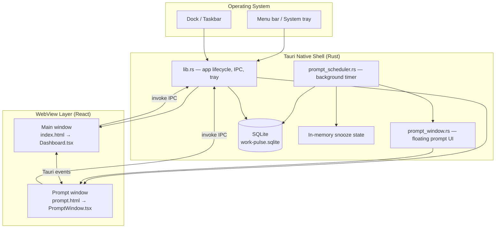
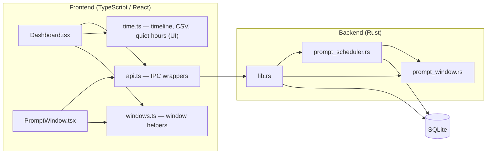
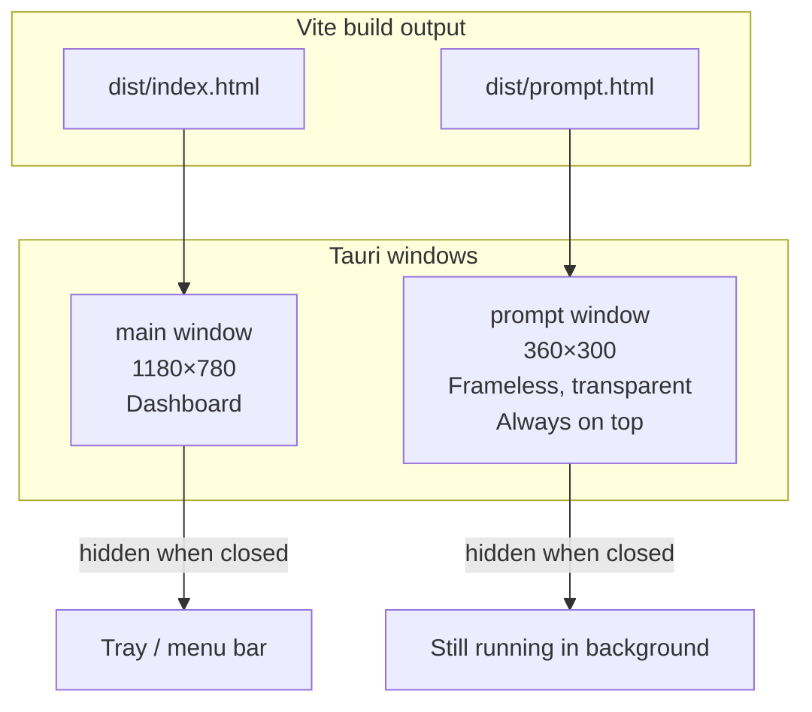
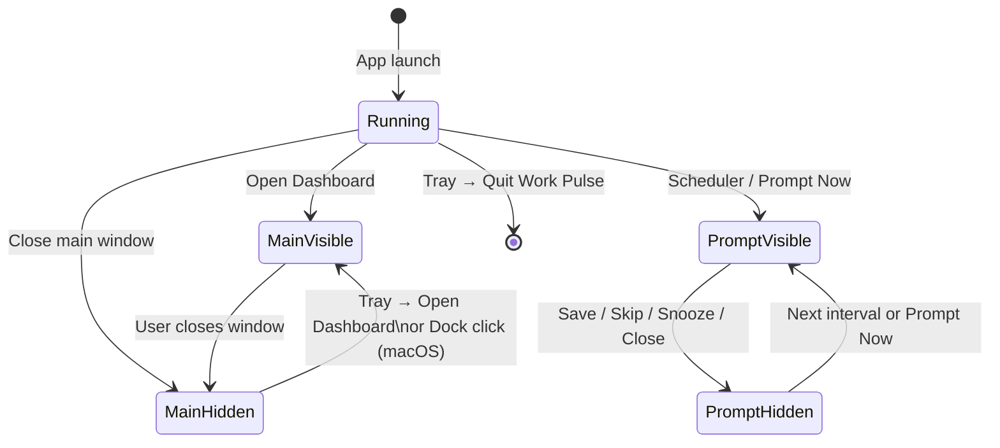
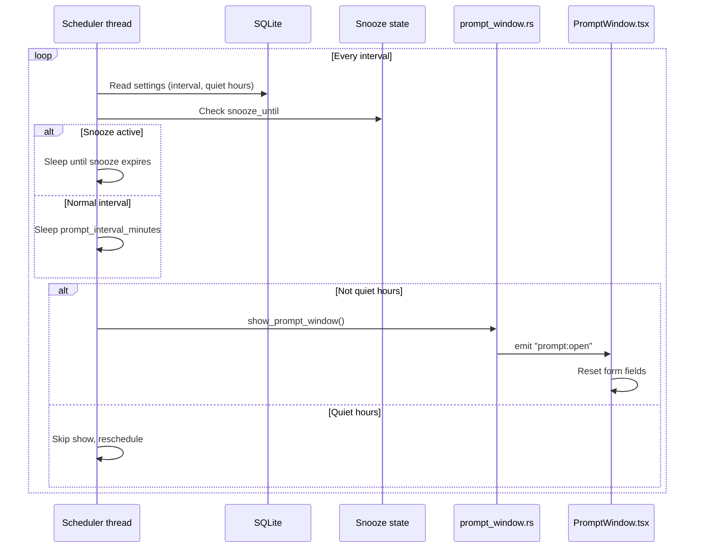
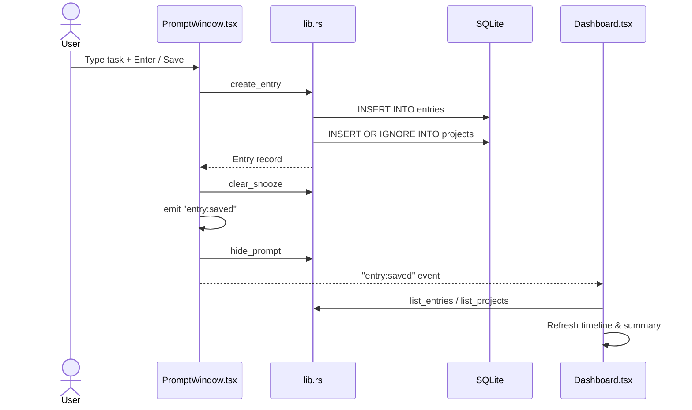
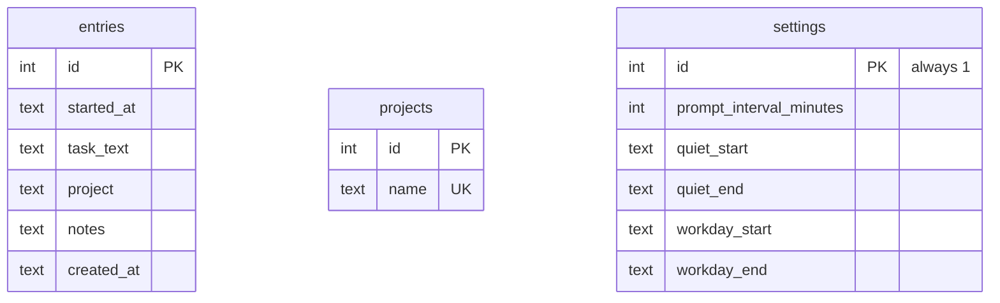
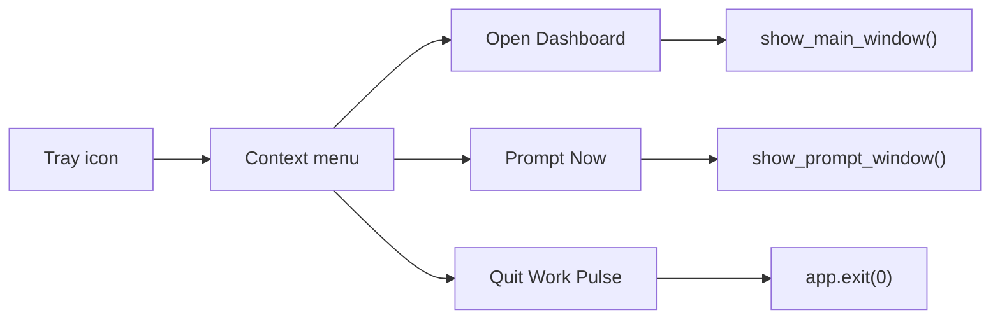
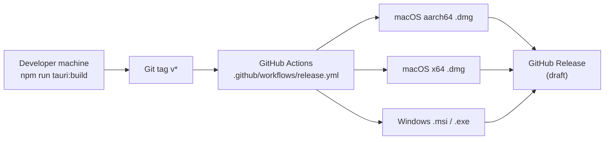

# Work Pulse — Architecture

Work Pulse is a cross-platform desktop timesheet assistant built with **Tauri 2**, **React**, **TypeScript**, and **SQLite**. It runs locally on macOS and Windows, prompts the user at a configurable interval, stores entries on disk, and helps produce weekly timesheet summaries.

This document describes how the system is structured, how data flows between components, and where key behavior lives in the codebase.

---

## High-level overview



### Design principles

| Principle | Implementation |
|---|---|
| Local-first | All data in SQLite under the OS app data directory |
| Background operation | App keeps running when windows are hidden; tray icon remains |
| Reliable prompting | Scheduler runs in a Rust thread, not in a hidden WebView |
| Separation of UI | Dashboard and prompt are independent windows and bundles |
| Close-to-hide | Closing a window hides it; only **Quit** from the tray exits the app |

---

## Runtime components



### Responsibilities

| Component | Path | Role |
|---|---|---|
| App entry | `src-tauri/src/main.rs` | Starts the Tauri runtime |
| Core backend | `src-tauri/src/lib.rs` | IPC commands, tray menu, DB access, window close-to-hide |
| Prompt scheduler | `src-tauri/src/prompt_scheduler.rs` | Background loop: interval, quiet hours, snooze |
| Prompt window control | `src-tauri/src/prompt_window.rs` | Show/hide, always-on-top, macOS positioning |
| Dashboard UI | `src/Dashboard.tsx` | Settings, daily log, weekly summary, CSV export |
| Prompt UI | `src/PromptWindow.tsx` | “What are you doing?” widget |
| IPC layer | `src/api.ts` | Typed wrappers around Tauri `invoke()` |
| Build config | `vite.config.ts` | Two HTML entry points: `main` and `prompt` |
| App config | `src-tauri/tauri.conf.json` | Window definitions, bundle settings |

---

## Window model

Work Pulse uses **two separate Tauri webview windows**, each with its own HTML entry point and React root.



| Window | Label | Entry | React root | Visible by default |
|---|---|---|---|---|
| Dashboard | `main` | `index.html` | `main.tsx` → `Dashboard.tsx` | Yes |
| Prompt widget | `prompt` | `prompt.html` | `prompt-main.tsx` → `PromptWindow.tsx` | No (shown by scheduler or tray) |

### Window lifecycle



Closing either window **does not quit the app**. The native shell intercepts `CloseRequested`, calls `prevent_close()`, and hides the window instead.

---

## Prompt scheduling

The prompt scheduler is the most important background subsystem. It runs in a **dedicated Rust thread** so prompts continue even when the dashboard WebView is hidden (macOS throttles JavaScript timers in background webviews).



### Scheduler triggers

| Trigger | Source |
|---|---|
| Automatic interval | `prompt_scheduler.rs` background thread |
| Manual | Tray menu → **Prompt Now** |
| Immediate (dev/testing) | Dashboard **Prompt Now** button → `show_prompt` IPC |

### Snooze handling

Snooze is stored in **Rust app state** (`PromptSchedulerState`), not in browser `localStorage`, so the scheduler and prompt window always agree.

| Action | IPC command | Effect |
|---|---|---|
| Snooze 10 min | `set_snooze` | Scheduler waits until snooze time |
| Save entry | `clear_snooze` | Resets snooze; normal interval resumes |
| Skip | — | No snooze change; normal interval resumes |

---

## Entry save flow



### Prompt actions

| Button / key | Behavior |
|---|---|
| **Save** / **Enter** | Validates task text → saves entry → clears snooze → hides prompt |
| **Skip** | Hides prompt without saving |
| **Snooze** | Sets 10-minute snooze → hides prompt |
| **×** close | Same as Skip |

---

## IPC commands

All frontend-to-backend calls go through `src/api.ts` → Tauri `invoke()`.

| Command | Called from | Purpose |
|---|---|---|
| `init_database` | Dashboard, Prompt | Ensure schema exists |
| `create_entry` | Prompt, Dashboard (quick entry) | Save a new time entry |
| `update_entry` | Dashboard | Edit an existing entry |
| `delete_entry` | Dashboard | Remove an entry |
| `list_entries` | Dashboard | Query entries by date range |
| `list_projects` | Dashboard, Prompt | Autocomplete project names |
| `get_settings` | Dashboard | Read prompt interval, quiet hours, workday |
| `update_settings` | Dashboard | Persist settings changes |
| `show_dashboard` | — | Show and focus main window |
| `show_prompt` | Dashboard, tray | Show prompt widget |
| `hide_prompt` | PromptWindow | Hide prompt widget |
| `set_snooze` | PromptWindow | Delay next scheduled prompt |
| `clear_snooze` | PromptWindow | Resume normal interval after save |

---

## Tauri events

Cross-window notifications use Tauri’s event bus (not IPC return values).

| Event | Emitter | Listener | Purpose |
|---|---|---|---|
| `prompt:open` | `prompt_window.rs` | `PromptWindow.tsx` | Reset form when prompt is shown |
| `entry:saved` | `PromptWindow.tsx` | `Dashboard.tsx` | Refresh entries after prompt save |
| `prompt:snoozed` | `PromptWindow.tsx` | `Dashboard.tsx` | Update status message |

---

## Data layer

### Storage location

| Platform | Path |
|---|---|
| macOS | `~/Library/Application Support/com.workpulse.app/work-pulse.sqlite` |
| Windows | `%APPDATA%\com.workpulse.app\work-pulse.sqlite` |

No cloud sync, accounts, or network calls are required at runtime.

### Schema



### Settings defaults

| Field | Default | Used by |
|---|---|---|
| `prompt_interval_minutes` | 30 | Rust scheduler |
| `quiet_start` | 18:00 | Rust scheduler |
| `quiet_end` | 08:00 | Rust scheduler |
| `workday_start` | 09:00 | Dashboard timeline inference |
| `workday_end` | 17:00 | Dashboard timeline inference |

---

## System tray integration



On macOS, clicking the **Dock icon** when all windows are hidden fires `RunEvent::Reopen` and reopens the dashboard.

---

## Platform-specific behavior

### macOS prompt window

Handled in `prompt_window.rs` via `objc2-app-kit`:

| Behavior | Mechanism |
|---|---|
| Float above other apps | `setLevel(3)`, `set_always_on_top(true)` |
| Visible on all Spaces | `NSWindowCollectionBehavior` flags |
| Position above Dock | `NSScreen.visibleFrame` |
| Draggable header | `data-tauri-drag-region` + `setMovableByWindowBackground(true)` |
| Bring to front | `orderFrontRegardless()` |

### Unsigned distribution

Installers from GitHub Releases are not code-signed. First launch may require manual approval (documented in [INSTALL.md](./INSTALL.md)).

---

## Build and release pipeline



### Local development

```sh
npm install
npm run tauri:dev      # hot-reload frontend + native shell
npm run tauri:build    # production bundle
```

Vite serves the frontend on port **1420** during development. Production builds output to `dist/`, which Tauri embeds in the native app bundle.

---

## Project structure

```
work-pulse/
├── index.html                 # Dashboard entry
├── prompt.html                # Prompt widget entry
├── src/
│   ├── main.tsx               # Dashboard React bootstrap
│   ├── prompt-main.tsx        # Prompt React bootstrap
│   ├── Dashboard.tsx          # Main app UI
│   ├── PromptWindow.tsx       # Prompt widget UI
│   ├── api.ts                 # Tauri IPC wrappers
│   ├── time.ts                # Date/time helpers, CSV, timeline
│   ├── types.ts               # Shared TypeScript types
│   └── windows.ts             # Window invoke helpers
├── src-tauri/
│   ├── src/
│   │   ├── main.rs            # Binary entry
│   │   ├── lib.rs             # Core backend + IPC
│   │   ├── prompt_scheduler.rs
│   │   └── prompt_window.rs
│   ├── tauri.conf.json        # Tauri app + window config
│   └── capabilities/          # Tauri permissions
├── .github/workflows/
│   └── release.yml            # CI release builds
├── scripts/
│   └── reinstall-mac.sh       # Local macOS reinstall helper
├── README.md
├── INSTALL.md
├── RELEASE_PLAN.md
└── ARCHITECTURE.md            # This document
```

---

## Key design decisions

### Why two windows?

The prompt needs to behave like a **notification widget** (small, frameless, always on top, separate from the dashboard). A modal inside the main window cannot reliably appear above other applications when the dashboard is hidden.

### Why Rust for scheduling?

JavaScript `setTimeout` in the dashboard WebView is **unreliable when the window is hidden**. macOS throttles background web content. A Rust thread keeps the prompt schedule accurate while the app runs from the menu bar.

### Why SQLite?

Simple, portable, zero-config local storage. Entries, projects, and settings are relational enough to benefit from SQL but small enough to avoid a heavier database.

### Why close-to-hide?

Timesheet apps should stay available in the background and prompt without requiring the dashboard to stay open. Users expect menu-bar-style behavior on macOS.

---

## Related documents

| Document | Contents |
|---|---|
| [README.md](./README.md) | Project overview and dev setup |
| [INSTALL.md](./INSTALL.md) | End-user installation guide |
| [RELEASE_PLAN.md](./RELEASE_PLAN.md) | Versioning and release workflow |
| [DEBUG.md](./DEBUG.md) | Troubleshooting local builds |
