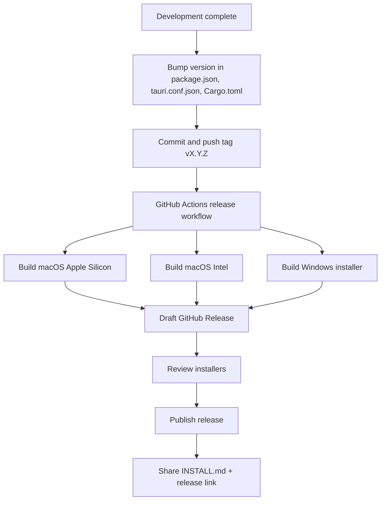

# Work Pulse Release Plan

This document describes how to version, build, and distribute Work Pulse to other machines.

## Distribution model

Work Pulse is distributed as **native installers**, not source code.

| Platform | Artifact | End-user install |
|---|---|---|
| macOS Apple Silicon | `.dmg` (`aarch64`) | Open DMG → drag to Applications |
| macOS Intel | `.dmg` (`x64`) | Open DMG → drag to Applications |
| Windows | `.msi` or `.exe` | Run installer |

End users should follow [INSTALL.md](./INSTALL.md).

## Versioning

Use [Semantic Versioning](https://semver.org/):

- `MAJOR`: breaking changes or major redesign
- `MINOR`: new features, backward compatible
- `PATCH`: bug fixes only

Keep these in sync before each release:

1. [package.json](./package.json) → `"version"`
2. [src-tauri/tauri.conf.json](./src-tauri/tauri.conf.json) → `"version"`
3. [src-tauri/Cargo.toml](./src-tauri/Cargo.toml) → `version`

Example: `0.1.0`, `0.2.0`, `1.0.0`

## Release workflow



## Automated builds (GitHub Actions)

The workflow at [.github/workflows/release.yml](./.github/workflows/release.yml) runs when:

- a tag matching `v*` is pushed (for example `v0.1.0`), or
- the workflow is started manually from the Actions tab

It builds installers on:

- `macos-latest` for Apple Silicon and Intel
- `windows-latest` for Windows

Installers are attached to a **draft** GitHub Release. Review the assets, then publish the release.

### First-time setup

1. Push this repository to GitHub.
2. Ensure Actions are enabled for the repository.
3. No extra secrets are required for unsigned builds (`GITHUB_TOKEN` is provided automatically).

### Creating a release

```sh
# 1. Update version numbers in package.json, tauri.conf.json, and Cargo.toml
# 2. Commit the changes
git add .
git commit -m "Release v0.1.0"

# 3. Tag and push
git tag v0.1.0
git push origin main
git push origin v0.1.0
```

4. Open GitHub → **Actions** and wait for the release workflow to finish.
5. Open **Releases**, review the draft release, verify installers, then click **Publish release**.
6. Share the release URL and [INSTALL.md](./INSTALL.md) with users.

## Manual local builds

Useful for testing before tagging a release.

### macOS

```sh
npm install
npm run tauri:build
```

Installers appear under:

```text
src-tauri/target/release/bundle/dmg/
src-tauri/target/release/bundle/macos/
```

### Windows

Run the same commands on a Windows machine:

```sh
npm install
npm run tauri:build
```

Installers appear under:

```text
src-tauri/target/release/bundle/msi/
src-tauri/target/release/bundle/nsis/
```

## App icons

Icons live in [src-tauri/icons/](./src-tauri/icons/).

To regenerate icons from the source image:

```sh
npm run tauri:icon
```

The source image is [app-icon-square.png](./app-icon-square.png) (1024×1024).

This updates PNG, `.icns`, and `.ico` assets used during bundling.

## Code signing (optional, later)

Unsigned builds are fine for personal use and small trusted groups.

For smoother installs at scale:

| Platform | Requirement | Benefit |
|---|---|---|
| macOS | Apple Developer Program + notarization | Removes Gatekeeper warnings |
| Windows | Authenticode certificate | Reduces SmartScreen warnings |

Signing can be added to the GitHub Actions workflow later without changing the app itself.

## Pre-release checklist

- [ ] Version bumped in all three files
- [ ] App runs locally with `npm run tauri:dev`
- [ ] Production build succeeds with `npm run tauri:build`
- [ ] Icons present in `src-tauri/icons/`
- [ ] [INSTALL.md](./INSTALL.md) reviewed (update GitHub URLs if needed)
- [ ] Tag pushed (`vX.Y.Z`)
- [ ] GitHub Actions workflow completed successfully
- [ ] Installers tested on target OS
- [ ] Draft release published

## Post-release

- Announce the release link to users
- Attach or link [INSTALL.md](./INSTALL.md)
- Track issues for the next patch or minor release
- Consider auto-update support in a future version using Tauri's updater plugin

## Recommended release cadence

| Stage | Cadence |
|---|---|
| Early personal use | Release when needed |
| Small team | Patch releases as fixes land; minor releases monthly |
| Broader rollout | Add signing, then follow semver strictly |
